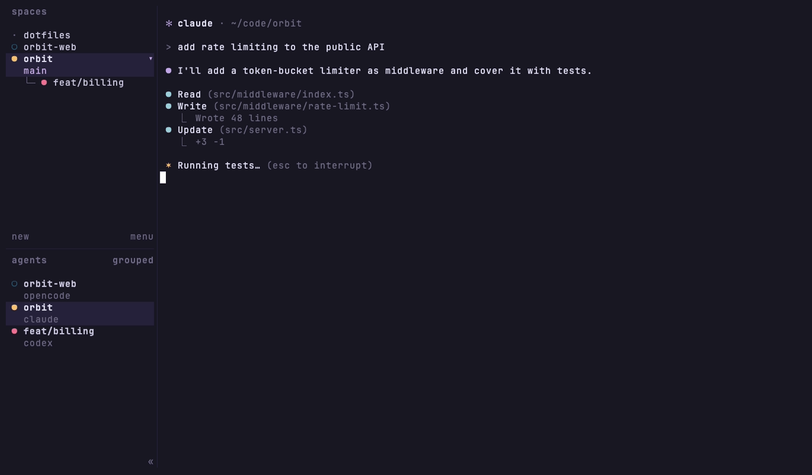

# herdr-sesh

A [sesh](https://github.com/joshmedeski/sesh)-style fuzzy picker for
[herdr](https://herdr.dev), built on fzf. Jump between workspaces and agents,
or open a new workspace from your sesh configs, zoxide history or any
directory, all from one popup. It also includes a "last workspace" toggle,
like `sesh last`.



## Features

- **Workspaces** with live agent state (`◉` blocked, `●` working, `✓` done,
  `○` idle). Linked git worktrees show as `repo/branch`. The current workspace
  comes first, then the rest in most-recently-used order.
- **Agents** across every workspace, with their status and terminal title.
- **sesh configs** from `sesh list -c`. Opening one runs its `startup_command`.
- **zoxide** directories, minus the ones already open in a workspace.
- **fd** directory search under `$HOME` (the command is configurable).
- **Previews**: the visible screen of a workspace or agent pane, or the
  directory listing (via `eza` when it is installed, `ls` otherwise).
- **Enter** focuses the workspace or agent. On a directory, it focuses the
  workspace that already has it open, or creates a new one.
- **Last workspace**: toggle between the current and previous workspace.

## Installation

```sh
herdr plugin install fedeya/herdr-sesh
```

Then add keybindings to `~/.config/herdr/config.toml` and reload the config
(see below).

### Requirements

- herdr **0.7.4** or newer
- Required: [`fzf`](https://github.com/junegunn/fzf), [`jq`](https://jqlang.org), `bash`
- Optional (sources are hidden when the tool is missing):
  [`sesh`](https://github.com/joshmedeski/sesh) (configs),
  [`zoxide`](https://github.com/ajeetdsouza/zoxide),
  [`fd`](https://github.com/sharkdp/fd) (find),
  [`eza`](https://github.com/eza-community/eza) (directory previews)
- Optional, only used for a custom popup size on herdr versions whose
  `plugin pane open` CLI has no `--width`/`--height` flags: `python3` or `nc`
  with Unix socket support (`-U`)

Linux and macOS are supported.

## Keybindings

The plugin provides two actions:

| Action                    | Description                       |
| ------------------------- | --------------------------------- |
| `fedeya.herdr-sesh.open`  | Open the picker in a popup        |
| `fedeya.herdr-sesh.last`  | Focus the previously used workspace |

Suggested bindings:

```toml
[[keys.command]]
key = "prefix+o"
type = "plugin_action"
command = "fedeya.herdr-sesh.open"
description = "sesh picker"

[[keys.command]]
key = "prefix+shift+l"
type = "plugin_action"
command = "fedeya.herdr-sesh.last"
description = "jump to previous workspace"
```

Apply them with:

```sh
herdr config check && herdr server reload-config
```

## Picker controls

| Key            | Action                                  |
| -------------- | --------------------------------------- |
| `enter`        | Focus or create the selected item       |
| `esc`          | Close the picker                        |
| `tab` / `btab` | Move down / up                          |
| `ctrl-a`       | All (sources from `picker.sources`)     |
| `ctrl-w`       | Workspaces                              |
| `ctrl-e`       | Agents                                  |
| `ctrl-g`       | sesh configs                            |
| `ctrl-x`       | zoxide                                  |
| `ctrl-f`       | find (fd)                               |
| `ctrl-d`       | Close the selected workspace            |

## Configuration

Configuration is optional. Copy the example into the plugin config directory
and edit it:

```sh
cp "$(herdr plugin list --json | jq -r '.result.plugins[] | select(.plugin_id == "fedeya.herdr-sesh") | .plugin_root')/config.example.toml" \
  "$(herdr plugin config-dir fedeya.herdr-sesh)/config.toml"
```

The file is a small subset of TOML, read by bash. It supports sections,
strings, booleans, numbers and single-line string arrays:

```toml
[popup]
width = "85%"        # terminal cells (120) or a percentage ("85%")
height = "80%"

[picker]
sources = ["workspaces", "configs", "zoxide"]  # ^a view: workspaces, agents, configs, zoxide, find
hide_open_dirs = true                          # hide dirs already open in a workspace
prompt = "⚡  "
border_label = " sesh "
preview = true
preview_window = "right:55%"

[fzf]
theme = "rose-pine"  # or "none" to inherit colors from FZF_DEFAULT_OPTS
colors = ""          # extra --color spec, e.g. "pointer:#ff0000"
options = ""         # extra fzf options, shell-quoted, e.g. "--layout=reverse"

[find]
command = 'fd -H -d 2 -t d -E .Trash . "$HOME"'
```

Notes:

- `FZF_DEFAULT_OPTS` is read from the environment of the herdr server, so it
  must be set in the shell that started herdr.
- `fzf.options` is applied last, so it overrides the built-in options.
- Without a `[popup]` size, the picker uses the manifest default: 85% × 80%.

## How it works

- A `workspace.focused` event hook records the current and previous
  workspace, plus an MRU list, in the plugin state directory
  (`$HERDR_PLUGIN_STATE_DIR`).
- The `open` action opens the `picker` pane entrypoint as a herdr popup. The
  popup runs fzf and closes when fzf exits.
- Everything else goes through the herdr CLI: `api snapshot`, `pane list`,
  `pane read`, `workspace create/focus/close`, `agent focus` and `pane run`.

## Development

```sh
git clone https://github.com/fedeya/herdr-sesh
herdr plugin link ./herdr-sesh
herdr plugin action list --plugin fedeya.herdr-sesh
herdr plugin log list --plugin fedeya.herdr-sesh
```

You can also run the picker in any terminal inside herdr with
`bash bin/herdr-sesh pick`.

The demo GIF is recorded with [vhs](https://github.com/charmbracelet/vhs) in a
throwaway environment: a fake `HOME` with sample projects, zoxide history,
sesh configs, simulated agents, and its own herdr server. It needs the
JetBrainsMono Nerd Font. To regenerate it, run:

```sh
docs/demo/record.sh
```

## License

[MIT](LICENSE)
